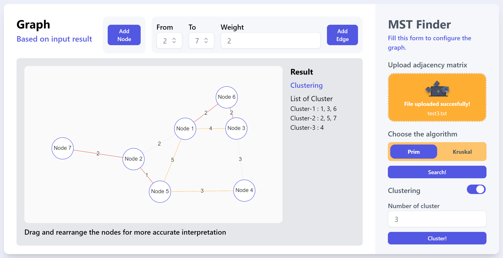

# 🌳 MST Finder
> Minimum Spanning Tree Finder Created using Prim and Kruskal Algorithm with React and Node.js

## General Information
MST Finder is a simple app created to find a minimum spanning tree based on user input. The program will proceed a.txt file which containt weighted adjacency matrix to interpret a graph, then find a minimum spanning tree using two most popular MST finder algorithm, prim and kruskal. User can also modify the graph by adding nodes and edges by filling the form. The program also provide a clustering mechanism for MST to make a better efficiency on searching and analyzing. Furthermore, the project information is also provided for future improvements.

## Project Structure
```bash
.
├─── img
├─── public
│   └─── index.html
├─── src
│   ├─── algorithms
│   │   ├─── clusterMST.js
│   │   ├─── kruskalMST.js
│   │   └─── primMST.js
│   ├─── assets/images
│   │   └─── upload.png
│   ├─── components
│   │   ├─── Dropdown
│   │   │   └─── Dropdown.js
│   │   ├─── Forms
│   │   │   └─── Forms.js
│   │   └─── Graph
│   │       └─── GraphConfig.js
│   ├─── helper
│   │   └─── helper.js
│   ├─── App.css
│   ├─── App.js
│   ├─── index.css 
│   └─── index.js
├─── test
│   ├─── test1.txt
│   ├─── test2.txt
│   ├─── test3.txt
│   └─── test4.txt
├─── .gitignore
├─── package-lock.json
├─── package.json
├─── postcss.config.cjs
├─── README.md
└─── tailwind.config.js
```

## Prerequisites
- node.js (v 18.12.1)
- npm (v 8.19.2)
- React (v 18.2.0)
- Tailwind (v 3.3.2)

## Algorithms
Algorithm implemented on backend side. Further implementation of algorithm stated on [this file](https://github.com/mikeleo03/MST-Finder/tree/main/src/algorithms)

## How to Compile and Run the Program
Clone this repository from terminal with this command
``` bash
$ git clone https://github.com/mikeleo03/MST-Finder.git
```
### Run the application on development server
Compile and download some required modules by running the following *command*
``` bash
$ npm install
$ npm start
```
### Run the application from deployed website
You can also run the whole program by clicking this [deployment link](https://github.com/mikeleo03/MST-Finder/tree/main/src/algorithms)

## How to Use the Program
1. Go to the website with the procedure explained before.
2. Insert a .txt file in the box provided on the form side to initiate a graph. The program also will give error messages if the input file is not well-formatted. If the input is valid, the graph of your input will be loaded in the left side with some additional buttons.
3. Explore the whole feature! You can add nodes and edges, you can select the algorithm then proceed the MST finding by your preferred algorithm, and you can also do clustering by enabling the cluster button on the bottom-right side then choose the number of cluster you wanted to.
Get to know more about the website interface by looking at the screenshots down below.

## Available Scripts
In the project directory, you can run:

### `npm start dev`

Ths runs the app in the development mode.

The page will reload if you make edits.<br />
You will also see any lint errors in the console. You can also use the environment by appyling the basic .env configuration on .env.example file.

## Screenshots



## Contributors
<a href = "https://github.com/mikeleo03/markdown-editor/graphs/contributors">
  
</a>